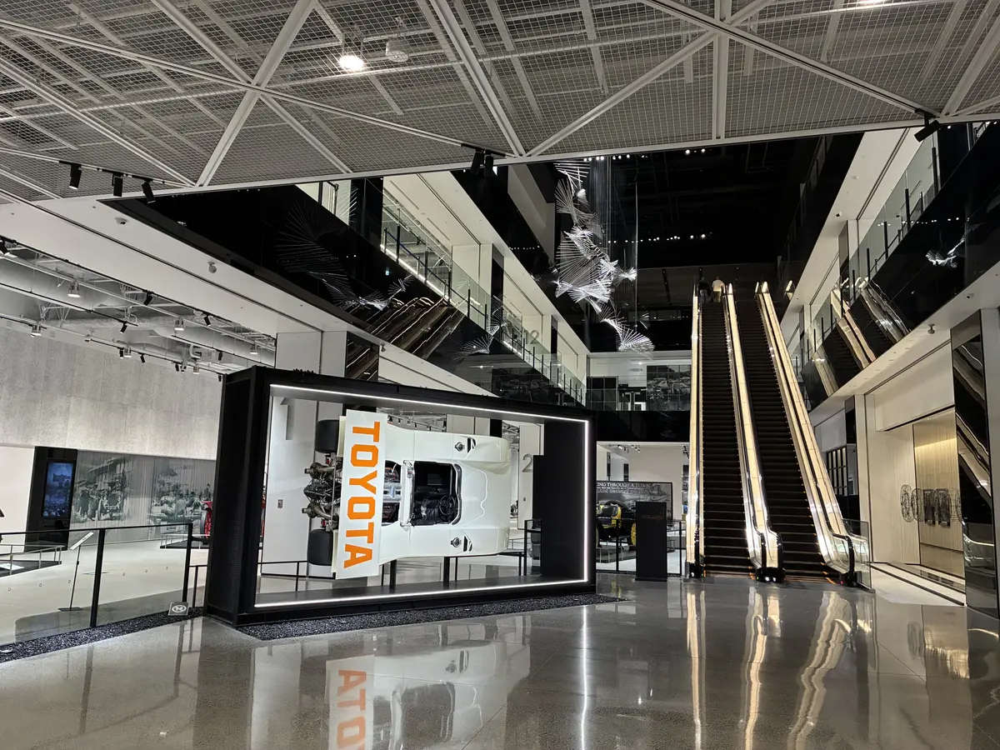
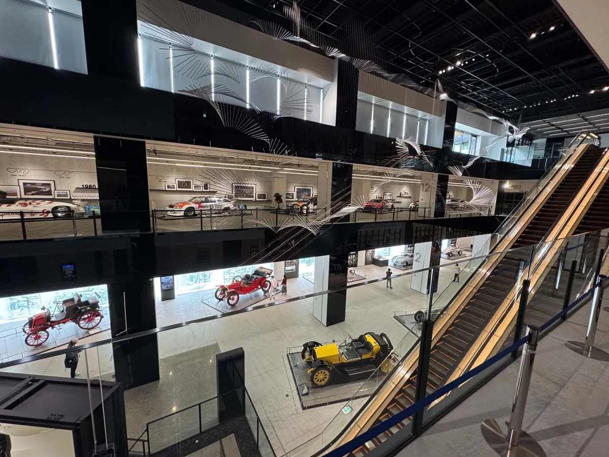
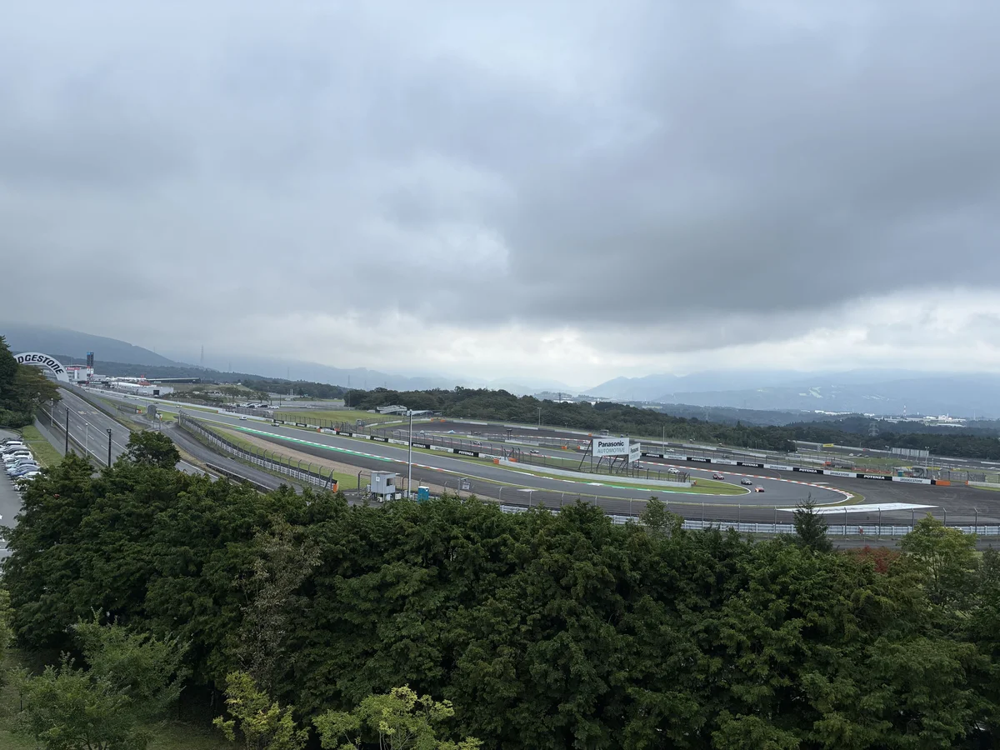
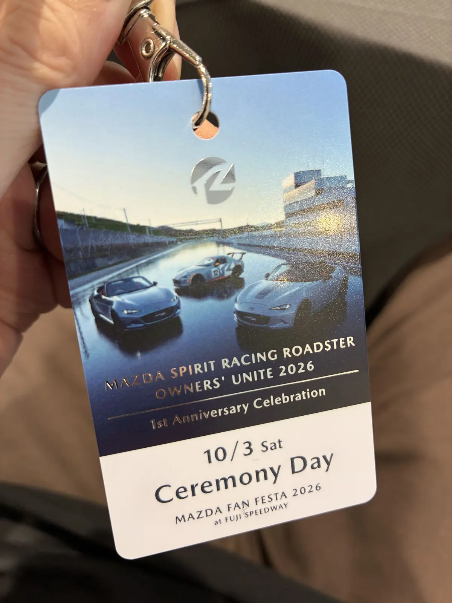
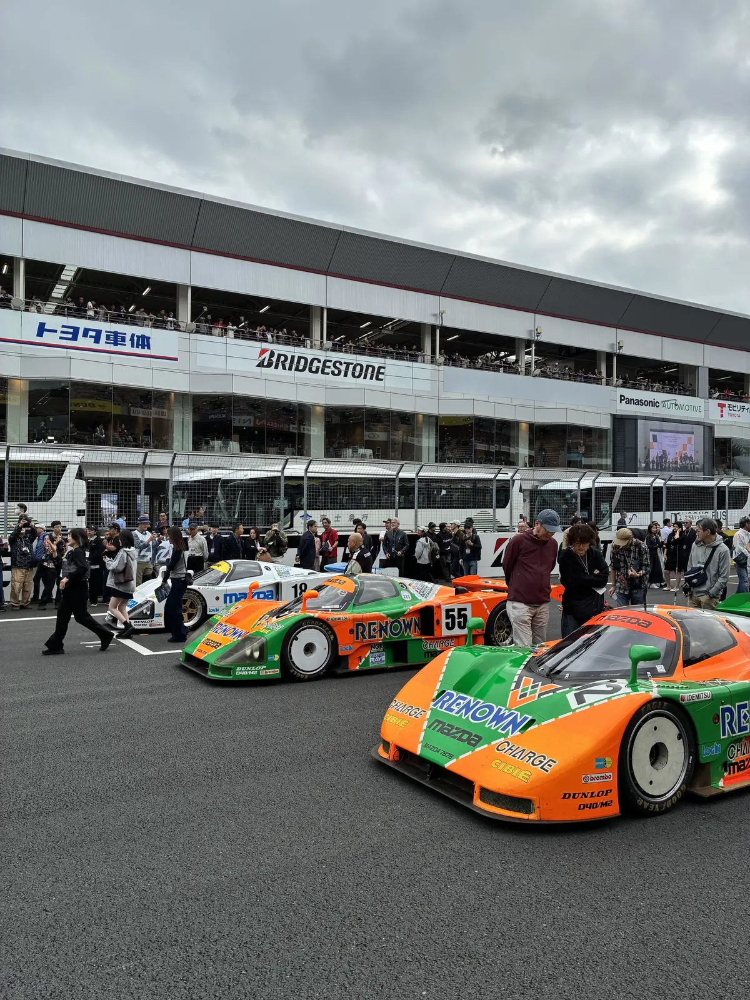

富士スピードウェイで開催されたマツダファンフェスタ2026に行ってきた。今回は前乗りで併設の富士スピードウェイホテルに1泊し、翌日にイベントに参加、もう1泊して帰るという2泊3日の日程。

京都東から富士スピードウェイまでは新御殿場経由で、休憩しつつ5時間半くらい。ロードスターでは初めての新東名だったけど、120km/h区間はみんな巡航速度が速くて結構疲れた。幌だとロードノイズや風切り音もそれなりにあって、それも疲れに繋がっている気がする。

ファンフェスタの開催があるからか、ホテルの駐車場にはすでにロードスターや MAZDA SPIRIT RACING ROADSTER（MSpR）がたくさん停まっていた。

エントランスを入るといきなりレーシングカーが展示されていて迫力があった。

ホテル内にある富士モータースポーツミュージアムも見応えがあったし、カフェからサーキットが見渡せるロケーションもいい。温泉やサウナが付いているのもありがたい。

翌日のマツダファンフェスタには MSpR のオーナーイベントで参加。会場駐車場では一生分の MSpR を見た気がする。マツダスピリットレーシングの社員さんと直接会話できたのも貴重な機会だった。

イベントでは 767B や 787B のデモラン、ロードスターのレースなんかもあった。デモラン前にはコースに降りて間近でマシンを見ることができた。

レースを見に行ったことがなかったので良い経験になったし、デモランの4ローターのエンジン音は独特ですごかった。スピリットレーシングが出ているS耐にも興味が出てきた。

部屋は富士山側だったんだけど、最終日の朝に富士山が見えたのでよかった。

往復の運転はなかなか疲れたけど、イベントもホテルも満喫できて行って本当によかった。
